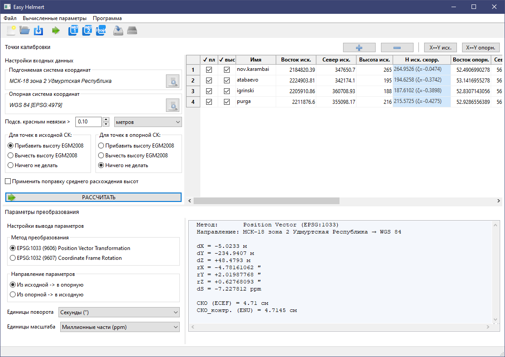

# Easy Helmert

Десктопное приложение для вычисления **7 параметров преобразования координат по Гельмерту**
(TO_WGS84 / TOWGS84) по набору общих точек в двух системах координат.


---

## Возможности

- Вычисление 7 параметров Гельмерта методом наименьших квадратов (LM)
- Поддержка методов **Position Vector (EPSG:1033)** и **Coordinate Frame (EPSG:1032)**
- Раздельное включение точек для **плановых** и **высотных** уравнений
- Поправка высот по геоиду **EGM2008** для исходной и/или опорной СК
- Поправка среднего расхождения **Балтийская система высот ↔ EGM2008**
- Импорт координат из текстовых файлов (CSV / TSV / TXT)
- Импорт и экспорт файлов калибровки геодезических контроллеров Carlson (`.loc`, `.cot`)
- Выбор СК из базы данных **EPSG + МСК РФ** или ввод вручную (WKT / Proj4)
- Экспорт результирующей СК в форматах **WKT1**, **WKT2**, **Proj4 / PRJ**
- Вывод невязок в геоцентрических (ΔX ΔY ΔZ) и метрических (dE dN dU) единицах

---

## Скриншот



---

## Установка и запуск

### Готовый exe (Windows)

1. Скачайте `EasyHelmert.exe` со страницы [Releases](../../releases)
2. Запустите `EasyHelmert.exe`

---

### Запуск из исходников

**Требования:** Python 3.11+, [uv](https://github.com/astral-sh/uv)

```bash
git clone https://github.com/ginhelly/easy_helmert.git
cd easy-helmert

# Установить зависимости
uv sync

# Запустить
uv run src/main.py